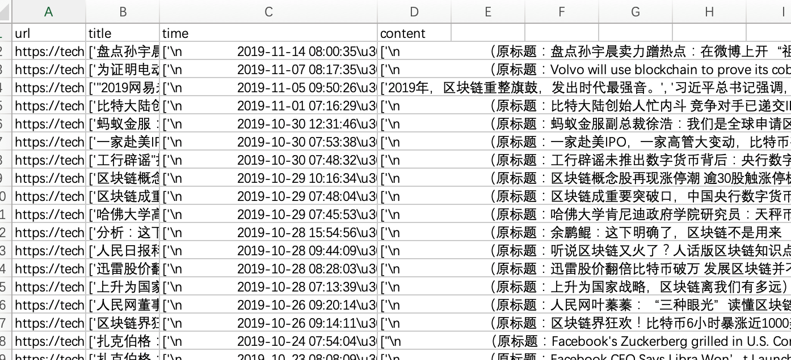

# 网易科技新闻-（区块链）爬虫
### 1. 目标网站：
有同学让我给爬新闻网站写paper，他研究内容是区块链，so，瞎jb找了一个网站，正好有区块链新闻专区：
 <http://tech.163.com/special/blockchain_2018>
 
### 2. 代码：
``` python
# -*- coding: utf-8 -*-
# @Time    : 20191115
# @Author  : anhan

'''
a crude demo for crawl blockchain news in netease
'''

import requests
from lxml import etree
import pandas as pd
import csv

headers = {"User-Agent":"Mozilla/5.0 (Windows NT 10.0; Win64; x64) AppleWebKit/537.36 (KHTML, like Gecko) Chrome/72.0.3626.121 Safari/537.36"}

def get_url_list(base_url, num):
    """
    # get page url list
    :param base_url
    :param num
    :return url_list
    """
    url_list = []
    url_list.append(base_url)
    for i in range(2, num+1):
        url_list.append(base_url + "_" + str(i).zfill(2))

    return url_list


def get_detail_url_list(url):
    """
    # get detail url in every page list
    :param url
    :return detail_url_list
    """
    response = requests.get(url, headers=headers)
    html = response.content.decode('gbk')
    selector = etree.HTML(html)
    detail_url_list = selector.xpath('//ul[@id="news-flow-content"]//li//div[@class="titleBar clearfix"]//h3//a/@href')

    return detail_url_list


def get_content(detail_url_list):
    """
    # crawl news content detail url list
    :param detail_url_list
    :return newscontent
    """
    item_list = []
    for detail_url in detail_url_list:
        item = {}
        print('begin: ', detail_url)
        response = requests.get(detail_url, headers=headers)
        html = response.content.decode('gbk')
        selector = etree.HTML(html)
        title = selector.xpath('//div[@class="post_content_main"]//h1/text()')
        timesource = selector.xpath('// div[@class="post_time_source"]//text()')
        content = selector.xpath('//div[@class="post_text"]//p/text()')

        item['url'] = detail_url
        item['title'] = title
        item['timesource'] = timesource
        item['content'] = content

        item_list.append(item)

    return item_list


def write_data(item_list):
    '''
    # write content data 2 csv
    :param item_list
    :return data.csv
    '''
    with open('news_blockchain_netease.csv', 'w', encoding='gbk', newline='') as f:
        writer = csv.DictWriter(f, fieldnames=['url','title','timesource','content'])
        writer.writeheader()
        for each in item_list:
            writer.writerow(each)


if __name__ == '__main__':
    #baseUrl = "http://tech.163.com/special/gd2016" # if not only blockchain news
    base_url = "http://tech.163.com/special/blockchain_2018"

    num = 2  # page count
    url_list = get_url_list(base_url, num)

    detail_url_list = []
    for url in url_list:
        for detail_url in get_detail_url_list(url):
            detail_url_list.append(detail_url)

    write_data(get_content(detail_url_list))
```

### 3. 执行：
直接把num换成要爬的网页页面数，运行即可。

### 4. 结果：
